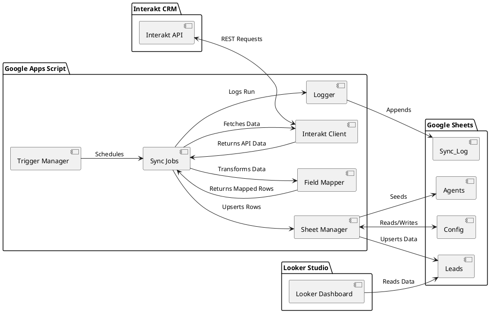
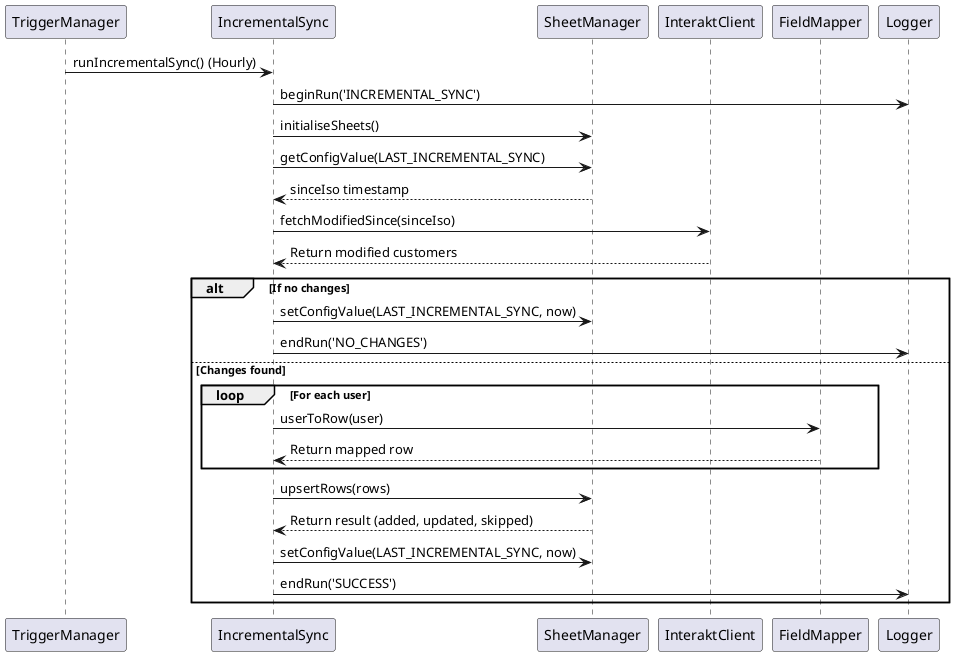
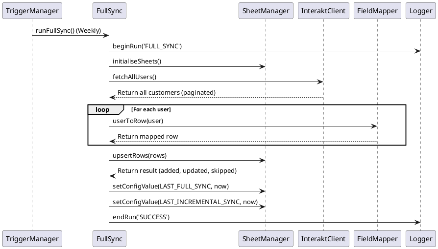
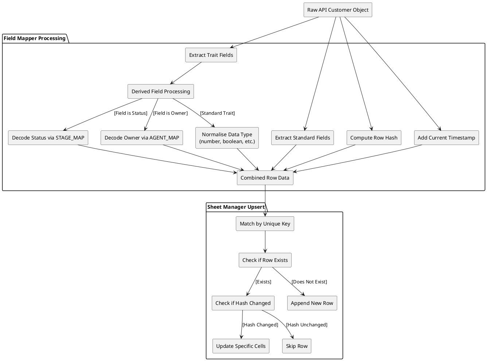

# Interakt to Google Sheets Connector — Architecture & Flow

This document provides a comprehensive overview of the system architecture, components, and workflows of the Interakt CRM to Google Sheets Connector.

## 1. System Overview

The solution is a modular Google Apps Script (GAS) application designed to extract customer data from the Interakt CRM API and synchronize it with a Google Spreadsheet. This spreadsheet then acts as the central data source for a Looker Studio Dashboard, providing near real-time insights into CRM leads.

### System Diagram

## 2. Synchronization Workflows

The application operates via two primary synchronization workflows managed by time-driven triggers: **Full Sync** and **Incremental Sync**.

### 2.1 Incremental Sync Sequence

The Incremental Sync runs hourly to fetch and upsert only the customers whose profiles have been modified since the last successful sync. This minimizes API load and ensures fast updates.

### 2.2 Full Sync Sequence

The Full Sync acts as a weekly reconciliation pass. It pulls the entire customer database from Interakt and updates the Google Sheet to ensure absolute consistency and capture any edge-case modifications.

## 3. Data Transformation & Upsert Flow

Data arriving from the Interakt API is highly nested and requires cleaning and normalization before it can be written to the flat structure of a Google Sheet.

The `FieldMapper` module handles deep property extraction, resolves system UUIDs to human-readable names (for stage and owner), and normalizes data types. The `SheetManager` handles intelligent upserts using a row hashing mechanism to detect modifications and prevent redundant writes.

## 4. Components & Modules

- **Config.gs**: The central configuration registry. Holds API keys, Sheet IDs, Field Maps, mappings for statuses and agents (UUIDs), and Trigger schedules.
- **InteraktClient.gs**: The HTTP interface to the Interakt API. Manages authentication, paginated API requests, and implements exponential back-off for rate limits and intermittent failures.
- **FieldMapper.gs**: The data transformation layer. Extracts fields based on `CONFIG`, resolves internal UUIDs, normalizes values to ensure Looker Studio compatibility, and generates a data hash for each record to support intelligent upserts.
- **SheetManager.gs**: The database interaction layer. Initializes required Sheet tabs, reads and updates the `Config` sheet, applies Tier-based color styling to columns, and handles the batch upsert logic to ensure optimal performance against Google Apps Script quotas.
- **Logger.gs**: The logging utility. Generates structured logs for the script's execution, writing them to both the Stackdriver console and the `Sync_Log` sheet for easy operational oversight.
- **TestRunner.gs**: A built-in test suite for validating field mappings and sheet configurations prior to deployment.
- **TriggerManager.gs**: Automates the creation and destruction of the time-driven triggers required to run the Sync jobs.
